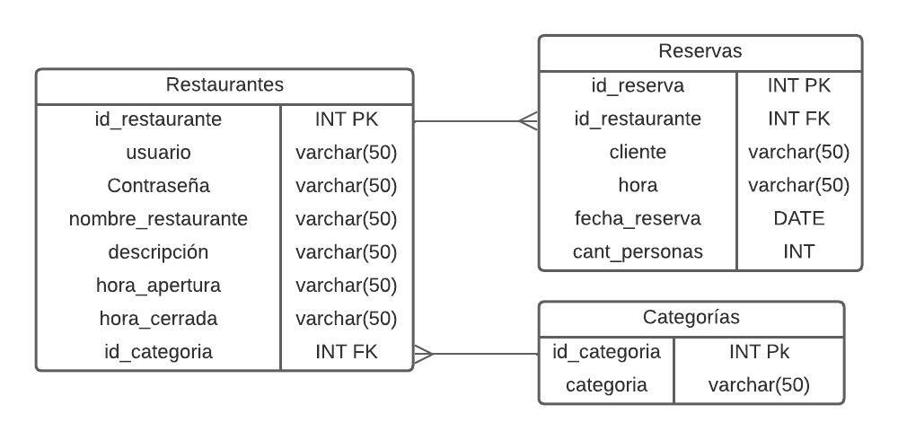

# API DE TABLETREK (PROYECTO 2)

## Descripción
Este repositorio contiene el código fuente del API utilizado en la página web de reservaciones de restaurantes. El API se encarga de la transferencia de datos entre el frontend y el backend de la aplicación, permitiendo la interacción del usuario con la base de datos PostgreSQL.

## Características

- Gestión de usuarios: El API permite la creación, autenticación y gestión de usuarios registrados en la aplicación.
- Consultas de restaurantes: Los usuarios pueden realizar consultas al API para obtener información sobre restaurantes disponibles, como nombre, horarios y tipo de categoría.
- Reservaciones: El API facilita la creación y gestión de reservaciones de los usuarios en los restaurantes registrados en la base de datos.
- Comunicación con la base de datos: El API establece conexiones con la base de datos PostgreSQL para almacenar y recuperar la información necesaria para las reservaciones de restaurantes.

## Tecnologías utilizadas

<ul>
    <li>
         
         
        <b>Node JS</b>
         
        Documentación 
         
        https://nodejs.org/es/docs
    </li>
    <li>
         
         
        <b>Express JS</b>
         
        Documentación 
         
        https://expressjs.com/es/
    </li>
    <li>
         
         
        <b>PostgreSQL</b>
         
        Documentación 
         
        https://www.postgresql.org/docs/
    </li>
<ul>
  

## Utiliza el proyecto
1. Clona este repositorio con el siguiente enlace : 'https://github.com/Jskenpo/API_PROYECTO2_STW.git'
     
2. Al clonar el repositorio abre una terminal en cosola y digrígete hacia la carpeta en donde colnaste el repositorio 
     
3. Utiliza el comando `npm install` para instalar todas las dependencias especificadas en el package.JSON
     
4. Seguidamente utiliza el comando `npm run dev` para poder inicializar el API en el puerto `localhost:3070`
     
5. Adicionalmente el API esta publicado en una intancia AWS con la dirección http://3.22.74.121:3070

## Estructura de proyecto
  <ul>
      <li>
          API_PROYECTO2_STW
           
          En este se alojan todas las configuraciones del proyecto     
      </li>
      <li>
          <a href='./src'>src</a>
           
          Es la carpeta en la que se alojan las rutas y los controladores del API, asimismo se alojan también las imágenes de todos los restaurantes.
      </li>
      <li>
          <a href='./src/imas'>imas</a>
           
          Carpeta en donde están todos los archivos multimedia que se utilizan en el API, es decir las imagenes de todos los restaurantes 
      </li>
      <li>
          <a href='./src/controllers'>Controladores</a>
           
          Carpeta en donde se alojan todos los controladores y procesos del API, maas especificamente se alojan los procesamientos de datos dentro del API y la conexión de base de datos RDS
      </li>
      <li>
          <a href='./src/routes'>Rutas</a>
           
          En esta carpeta se alojan todos los puntos de entrada (endpoints) del API, con los métodos POST, GET, y DELETE respectivos.
      </li>
  </ul>

  ## Endpoints
  <ul>
      <li>
        <b>POST</b>
           
          `3.22.74.121:3070/archivo/:id` enpoint para subir un archivo con el nombre de id
           
          `3.22.74.121:3070/restaurantes` enpoint para publicar un nuevo restaurante 
           
          `3.22.74.121:3070/reservaciones`  enpoint para publicar una nueva reservación
      </li>
      <li>
          <b>GET</b>
           
          `3.22.74.121:3070/reservaciones/:id` enpoint para ver las reservaciones por id del restaurante
           
          `3.22.74.121:3070/restaurantes`  enpoint para ver todos los restaurantes 
           
          `3.22.74.121:3070/restaurantes/raw`  enpoint para ver el formato oiginal de la tabla restaurantes
           
          `3.22.74.121:3070/restaurantes/:id`  enpoint para ver los restaurantes por categoría
      </li>
      <li>
          <b>DEKETE</b>
           
          `3.22.74.121:3070/reservaciones/:id` enpoint para eliminar una reservación por su id
      </li>
  </ul>
    
 ## Diagrama Entidad - Relación
 

